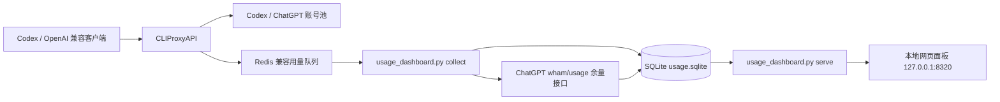
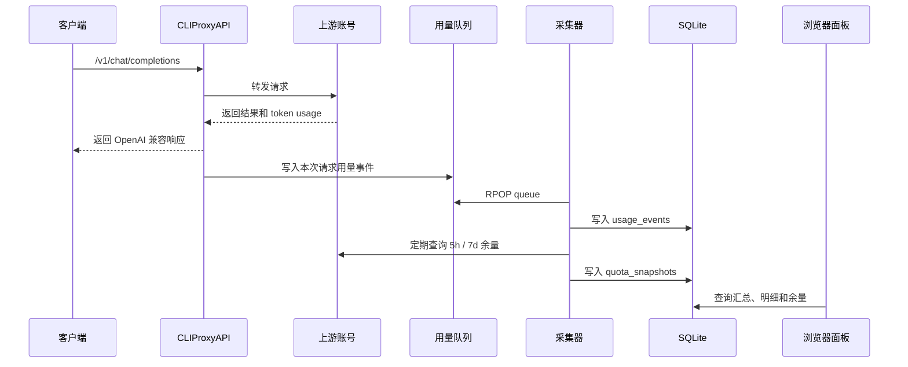

# CLIProxyAPI 用量统计面板

这是一个面向 [CLIProxyAPI](https://github.com/router-for-me/CLIProxyAPI) 的本地用量统计和可视化面板。

它会持续从 CLIProxyAPI 的 Redis 兼容用量队列中采集每次请求记录，写入本地 SQLite，并通过网页展示：

- 每次任务/请求的 token 消耗
- 按日、月、年筛选的总消耗
- 日视图按 24 小时、月视图按自然日、年视图按 12 个月展示的柱状图
- 按账号统计的请求数、token 消耗和失败数
- 按模型统计的 token 消耗
- Codex / ChatGPT 账号的 5 小时与 7 天余量

默认只监听 `127.0.0.1`，适合放在个人电脑或本地开发机上使用。

## 面板预览


上图是脱敏预览图，使用模拟账号和模拟数值，不包含真实邮箱、真实 token、真实密钥或真实用量数据。

## 设计目标

这个项目解决三个问题：

1. CLIProxyAPI 可以代理多个 Codex / GPT 账号，但日常使用时不容易看清每个账号实际消耗了多少。
2. ChatGPT / Codex 账号有 5 小时和 7 天窗口限制，需要一个聚合视图快速判断哪个账号还能用。
3. CLIProxyAPI 的用量队列是短期队列，适合实时消费，不适合长期统计；因此需要落库保存。

本项目的设计原则：

- **本地优先**：所有用量数据保存在本机 SQLite，不上传到第三方服务。
- **最小依赖**：只依赖 Python 标准库，不需要安装 Redis 客户端或 Web 框架。
- **脱敏发布**：仓库只包含源码、模板和说明，不包含 API key、OAuth token、数据库或日志。
- **可长期运行**：提供 macOS LaunchAgent 模板，采集器和面板可以开机自启。

## 架构图



## 数据流



## 统计逻辑

### 每次请求

采集器会把 CLIProxyAPI 队列里的每条事件写入 `usage_events` 表，核心字段包括：

- 时间：`timestamp`、`local_date`、`local_hour`
- 账号：`source`、`auth_index`
- 模型：`model`
- 接口：`endpoint`
- 状态：`failed`
- 耗时：`latency_ms`
- token：`input_tokens`、`output_tokens`、`reasoning_tokens`、`cached_tokens`、`total_tokens`

### 日期筛选

网页面板使用顶部日期选择器作为统计数据的主筛选控件：

- 选择“日”：统计本地时区这一天 00:00 到次日 00:00 前的数据，柱状图固定显示 24 根柱子。
- 选择“月”：统计这个自然月的数据，柱状图按当月天数显示，例如 28、29、30 或 31 根柱子。
- 选择“年”：统计这一整年数据，柱状图固定显示 12 根柱子，每月一根。

日视图会压缩左侧 `00:00` 到 `07:00` 的弱化区间，让 `08:00` 到 `24:00` 前的正常显示区占据主要宽度。

柱状图顶部的 token 数值会使用 `K` / `M` 紧凑格式，并对相邻标签做避让绘制，避免大数字挤在一起影响阅读；完整数值仍可在明细表和接口响应中查看。

日期选择器会刷新 KPI、账号消耗、API 统计、模型消耗、主柱状图和“最近每次请求/任务”；不会影响“账号余量”。

### 账号余量

采集器会定期读取本地 Codex OAuth 文件中的 access token，并查询 ChatGPT 后端的 `wham/usage` 接口，保存每个账号的：

- 账号是否可用
- 5 小时窗口已用百分比和剩余百分比
- 7 天窗口已用百分比和剩余百分比
- 对应窗口的重置时间
- credits balance
- OAuth 授权文件中的订阅到期时间 `expired`，并派生页面展示用的剩余天数

账号余量刷新策略：

- 采集器每 `quota_refresh_seconds` 秒自动刷新一次真实余量，默认是 14,400 秒（4 小时）。
- 页面自动刷新会请求 `/api/quota`；如果当前 OAuth 账号的本地快照仍在 4 小时有效期内，只返回本地数据库快照。
- 如果没有快照，或最新快照已经超过 4 小时，普通 `/api/quota` 会触发一次真实刷新。
- 顶部“刷新”和账号余量面板内的刷新按钮都会请求 `/api/quota?force=1`，强制刷新真实余量。
- `/api/quota` 只返回当前 OAuth 文件中仍存在且带有 `access_token` 的账号，历史快照账号不会继续展示。

## 前置条件

- Python 3.9+
- 已安装并运行 CLIProxyAPI
- CLIProxyAPI Management API 已启用
- CLIProxyAPI 用量统计已启用

建议在 CLIProxyAPI 配置中启用：

```yaml
usage-statistics-enabled: true
redis-usage-queue-retention-seconds: 3600
```

`redis-usage-queue-retention-seconds` 用于延长队列保留时间，避免采集器短暂停止时丢失事件。

## 安装

```bash
mkdir -p ~/.cli-proxy-api/usage-dashboard
cp usage_dashboard.py ~/.cli-proxy-api/usage-dashboard/
cp config.json ~/.cli-proxy-api/usage-dashboard/config.json
chmod 700 ~/.cli-proxy-api/usage-dashboard
chmod 600 ~/.cli-proxy-api/usage-dashboard/config.json
```

编辑：

```bash
~/.cli-proxy-api/usage-dashboard/config.json
```

填入你的 CLIProxyAPI Management API 明文密钥：

```json
{
  "cliproxy_host": "127.0.0.1",
  "cliproxy_port": 8317,
  "management_key": "replace-with-your-management-key",
  "poll_interval_seconds": 2,
  "quota_refresh_seconds": 14400,
  "dashboard_host": "127.0.0.1",
  "dashboard_port": 8320,
  "cliproxy_config_path": "../config.yaml"
}
```

也可以用环境变量覆盖：

```bash
export CLIPROXY_MANAGEMENT_KEY="your-management-key"
```

初始化数据库：

```bash
python3 ~/.cli-proxy-api/usage-dashboard/usage_dashboard.py init
```

## 启动

### Windows 一键启动（推荐）

先确认 CLIProxyAPI 已经启动，并且 Management API 监听在配置里的地址，默认是：

```text
127.0.0.1:8317
```

然后在项目目录双击：

```text
start_dashboard.cmd
```

这个脚本会在同一个终端里启动采集器和网页面板：

- 采集器：持续从 CLIProxyAPI 用量队列采集数据
- 网页面板：监听 `http://127.0.0.1:8320`

脚本会优先使用本机 Codex runtime Python；如果该路径不存在，会回退到 PATH 中的 `python`。

浏览器访问：

```text
http://127.0.0.1:8320
```

退出时，在启动窗口里按 `Ctrl+C`，采集器和网页面板会一起停止。看到 `Services stopped.` 后，可以关闭窗口。

### 命令行统一启动

如果不用 `start_dashboard.cmd`，也可以直接运行统一命令：

```bash
python3 ~/.cli-proxy-api/usage-dashboard/usage_dashboard.py run
```

`run` 会在同一个进程中启动采集器和网页面板，按 `Ctrl+C` 停止。

### 分开运行（调试用）

需要单独调试采集器时，打开第一个终端：

```bash
python3 ~/.cli-proxy-api/usage-dashboard/usage_dashboard.py collect
```

需要单独调试网页服务时，打开第二个终端：

```bash
python3 ~/.cli-proxy-api/usage-dashboard/usage_dashboard.py serve
```

## macOS 后台运行

复制 LaunchAgent 模板：

```bash
mkdir -p ~/Library/LaunchAgents
cp launchd/com.cliproxyapi.usage-collector.plist ~/Library/LaunchAgents/
cp launchd/com.cliproxyapi.usage-dashboard.plist ~/Library/LaunchAgents/
```

把 plist 里的 `/Users/YOUR_USER` 替换成你的真实 home 目录。

加载服务：

```bash
launchctl bootstrap gui/$(id -u) ~/Library/LaunchAgents/com.cliproxyapi.usage-collector.plist
launchctl bootstrap gui/$(id -u) ~/Library/LaunchAgents/com.cliproxyapi.usage-dashboard.plist
```

检查状态：

```bash
launchctl print gui/$(id -u)/com.cliproxyapi.usage-collector
launchctl print gui/$(id -u)/com.cliproxyapi.usage-dashboard
```

卸载服务：

```bash
launchctl bootout gui/$(id -u) ~/Library/LaunchAgents/com.cliproxyapi.usage-collector.plist
launchctl bootout gui/$(id -u) ~/Library/LaunchAgents/com.cliproxyapi.usage-dashboard.plist
```

## 命令行查询

查看今日汇总：

```bash
python3 ~/.cli-proxy-api/usage-dashboard/usage_dashboard.py report today
```

查看最近 5 小时：

```bash
python3 ~/.cli-proxy-api/usage-dashboard/usage_dashboard.py report 5h
```

强制刷新账号余量：

```bash
python3 ~/.cli-proxy-api/usage-dashboard/usage_dashboard.py quota --force
```

## API

网页服务同时提供本地 JSON API：

```text
GET /api/health
GET /api/summary?period_type=day&period_key=2026-05-19
GET /api/summary?period_type=month&period_key=2026-05
GET /api/summary?period_type=year&period_key=2026
GET /api/quota
GET /api/quota?force=1
GET /api/requests?limit=100&period_type=day&period_key=2026-05-19
```

`period_type` 支持：

- `day`：`period_key` 格式为 `YYYY-MM-DD`
- `month`：`period_key` 格式为 `YYYY-MM`
- `year`：`period_key` 格式为 `YYYY`

为了兼容命令行报表和旧调用，`/api/summary?range=today|1h|5h|24h|7d` 仍然可用；网页面板使用新的 `period_type` / `period_key` 参数。

`/api/requests` 也支持同样的 `period_type` / `period_key` 参数，用于让“最近每次请求/任务”跟随日期选择器过滤；不传时返回全局最新请求。

`/api/quota` 只返回页面展示需要的余量字段，不返回本地保存的 `raw_json`；订阅剩余天数来自本地 OAuth 授权文件的 `expired` 字段。

## 数据文件

默认文件位置：

```text
~/.cli-proxy-api/usage-dashboard/config.json
~/.cli-proxy-api/usage-dashboard/usage.sqlite
~/.cli-proxy-api/usage-dashboard/logs/
```

其中：

- 运行目录中的 `config.json` 包含本地管理密钥，不能提交；仓库根目录的 `config.json` 是脱敏模板。
- `usage.sqlite` 包含账号名和用量统计，不能提交。
- `logs/` 可能包含运行错误信息，不能提交。

## 发布与回滚

发布前的 lint、测试、构建、冒烟、兼容性、安全扫描和上线后验证步骤维护在 [docs/deployment.md](docs/deployment.md)。

本次及后续发布变更记录维护在 [CHANGELOG.md](CHANGELOG.md)。生产回滚时优先切回上一版 `usage_dashboard.py`，本次版本没有新增 SQLite schema 字段，通常不需要回滚数据库；如需恢复数据状态，应在停止服务后恢复发布前备份的 `usage.sqlite` 及其 WAL/SHM 文件。

## 安全与脱敏

仓库不应包含以下内容：

- CLIProxyAPI Management API 明文密钥
- CLIProxyAPI API key
- OAuth `access_token`
- OAuth `refresh_token`
- OAuth `id_token`
- 本地运行目录中的 `config.json`（仓库根目录模板除外）
- 本地临时备份 `config.local.json`
- SQLite 数据库
- 日志文件
- 真实账号邮箱

本仓库的 `.gitignore` 默认排除：

```text
config.local.json
/~/
*.sqlite
*.sqlite-shm
*.sqlite-wal
logs/
__pycache__/
*.pyc
.DS_Store
```

发布前建议执行：

```bash
git grep -n -I "refresh_token\|id_token\|gho_\|Bearer [A-Za-z0-9]\|chatgpt_account_id"
```

如果命中真实值，不要发布，先清理 git 历史。

采集请求事件时，`api_key_hash` 用于聚合统计；`raw_json` 会在入库前替换 `api_key`、`authorization`、`access_token`、`refresh_token` 和 `id_token` 等敏感字段，避免完整密钥进入 SQLite。

## 限制

- 只能统计采集器启动之后的请求，历史数据无法补回。
- CLIProxyAPI 的队列是短期队列，采集器长时间停止会丢失期间事件。
- 账号余量查询依赖 ChatGPT 后端接口，接口变更时可能需要调整。
- 面板默认不做多用户认证，应保持监听 `127.0.0.1`。

## 许可证

MIT
