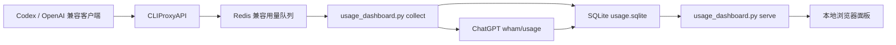

# CLIProxyAPI 用量统计面板项目维护文档

最后更新：2026-05-19

本文档用于记录当前项目实现现状、模块边界、数据与接口契约，以及后续需求变更时必须同步检查的内容。以后修改功能、页面、字段、配置、部署方式时，请同步更新本文档。

## 1. 项目定位

本项目是一个面向 CLIProxyAPI 的本地用量统计和可视化面板。

核心目标：

- 从 CLIProxyAPI 的 Redis 兼容用量队列中持续采集请求事件。
- 将每次请求的账号、模型、接口、耗时、token 消耗、失败状态等信息写入本地 SQLite。
- 定期读取本地 Codex OAuth 凭证，查询 ChatGPT 后端余量接口，保存账号 5 小时和 7 天余量快照。
- 通过本地网页面板展示用量汇总、账号消耗、模型消耗、API key 消耗、账号余量和最近请求明细。

当前实现是一个轻量级单文件 Python 应用，主文件为 `usage_dashboard.py`。它同时承担采集器、SQLite 初始化、JSON API 服务、HTML 页面服务和命令行报表功能。

## 2. 目录结构

```text
cliproxyapi-usage-dashboard/
  README.md
  usage_dashboard.py
  config.json
  run_collector.cmd
  .gitignore
  docs/
    dashboard-preview.svg
    project-handbook.md
  launchd/
    com.cliproxyapi.usage-collector.plist
    com.cliproxyapi.usage-dashboard.plist
```

说明：

- `README.md`：面向使用者的安装、运行和安全说明。
- `usage_dashboard.py`：项目主程序，包含采集、存储、接口和前端页面。
- `config.json`：脱敏配置模板，可复制到运行目录后填入本机密钥。
- `run_collector.cmd`：Windows 下启动采集器并写入本地日志的辅助脚本。
- `docs/dashboard-preview.svg`：脱敏预览图。
- `docs/project-handbook.md`：面向维护和需求变更的项目文档。
- `launchd/*.plist`：macOS 后台运行模板。

本地运行过程中会生成或使用以下敏感文件，不能提交：

- 运行目录中的 `config.json`
- 仓库根目录中的 `config.local.json`
- `*.sqlite`
- `*.sqlite-shm`
- `*.sqlite-wal`
- `logs/`
- `~/.cli-proxy-api/` 下的 OAuth 凭证文件

## 3. 运行模式

`usage_dashboard.py` 提供以下命令：

```text
python usage_dashboard.py init
python usage_dashboard.py collect
python usage_dashboard.py serve
python usage_dashboard.py quota --force
python usage_dashboard.py report today
python usage_dashboard.py report 1h
python usage_dashboard.py report 5h
python usage_dashboard.py report 24h
python usage_dashboard.py report 7d
```

命令职责：

| 命令 | 职责 |
| --- | --- |
| `init` | 初始化运行目录、配置文件和 SQLite 表结构。 |
| `collect` | 长驻采集 CLIProxyAPI 用量队列，并按周期刷新账号余量。 |
| `serve` | 启动本地网页服务和 JSON API。 |
| `quota --force` | 手动强制刷新账号余量。 |
| `report <range>` | 输出指定时间窗口的 JSON 汇总报表。 |

当前网页默认地址由 `config.json` 控制，默认是：

```text
http://127.0.0.1:8320/
```

## 4. 配置项

默认运行目录：

```text
~/.cli-proxy-api/usage-dashboard
```

默认配置文件：

```text
~/.cli-proxy-api/usage-dashboard/config.json
```

当前配置项：

| 字段 | 默认值 | 说明 |
| --- | --- | --- |
| `cliproxy_host` | `127.0.0.1` | CLIProxyAPI Management API 的 RESP 连接地址。 |
| `cliproxy_port` | `8317` | CLIProxyAPI Management API 的 RESP 端口。 |
| `management_key` | 空字符串 | CLIProxyAPI Management API 明文密钥。 |
| `poll_interval_seconds` | `2` | 采集器轮询用量队列的间隔。 |
| `quota_refresh_seconds` | `7200` | 账号余量刷新间隔。 |
| `dashboard_host` | `127.0.0.1` | 网页面板监听地址。 |
| `dashboard_port` | `8320` | 网页面板监听端口。 |
| `cliproxy_config_path` | 上级目录 `config.yaml` | 用于读取 CLIProxyAPI `api-keys` 并在页面上展示脱敏 API 标识。 |

环境变量覆盖：

| 环境变量 | 覆盖字段 |
| --- | --- |
| `CLIPROXY_MANAGEMENT_KEY` | `management_key` |
| `CLIPROXY_CONFIG_PATH` | `cliproxy_config_path` |

维护注意：

- 新增配置项时，需要同步更新 `DEFAULT_CONFIG`、README、本文档和任何示例配置。
- 如果配置项影响部署脚本，还要同步检查 `run_collector.cmd` 和 `launchd/*.plist`。
- `management_key`、OAuth token、API key 不能写入文档、截图、提交记录或示例真实值。

## 5. 数据流



采集链路：

1. CLIProxyAPI 将每次请求的用量事件写入 Redis 兼容队列 `queue`。
2. `RespClient` 使用 RESP 协议连接 CLIProxyAPI Management API，并执行 `AUTH`。
3. `collect_forever()` 循环执行 `RPOP queue 100`。
4. `insert_usage()` 解析 JSON 事件并写入 `usage_events`。
5. 同一采集进程按 `quota_refresh_seconds` 调用 `refresh_quota(force=True)`。

展示链路：

1. 浏览器访问 `/` 获取内置 HTML。
2. 页面 JavaScript 同时请求 `/api/summary`、`/api/quota`、`/api/requests`。
3. 页面每 30 秒自动刷新一次数据。
4. 用户点击“刷新余量”时，会请求 `/api/quota?force=1`。

## 6. 数据库表

数据库文件：

```text
~/.cli-proxy-api/usage-dashboard/usage.sqlite
```

SQLite 使用 WAL 模式，并设置了 `busy_timeout=5000`。

### 6.1 `usage_events`

保存每次请求或任务的用量事件。

| 字段 | 说明 |
| --- | --- |
| `id` | 自增主键。 |
| `event_key` | 去重键，优先使用 `request_id`，没有则使用原始 JSON 的 SHA-256。 |
| `timestamp` | UTC ISO 时间。 |
| `ts_epoch` | UTC epoch 秒，用于查询过滤。 |
| `local_date` | Asia/Shanghai 本地日期。 |
| `local_hour` | Asia/Shanghai 本地小时桶。 |
| `request_id` | 请求 ID。 |
| `auth_index` | CLIProxyAPI 认证索引。 |
| `source` | 账号或来源标识。 |
| `provider` | 上游提供商。 |
| `model` | 模型名称。 |
| `endpoint` | 请求接口。 |
| `auth_type` | 认证类型。 |
| `api_key_hash` | 客户端 API key 的短 hash，用于脱敏统计。 |
| `failed` | 是否失败，`0` 或 `1`。 |
| `latency_ms` | 请求耗时。 |
| `input_tokens` | 输入 token。 |
| `output_tokens` | 输出 token。 |
| `reasoning_tokens` | 推理 token。 |
| `cached_tokens` | 缓存 token。 |
| `total_tokens` | 总 token。 |
| `raw_json` | 原始事件 JSON。 |

相关索引：

- `idx_usage_ts`
- `idx_usage_date`
- `idx_usage_source`
- `idx_usage_auth`

### 6.2 `quota_snapshots`

保存账号余量快照。

| 字段 | 说明 |
| --- | --- |
| `id` | 自增主键。 |
| `timestamp` | 快照采集时间。 |
| `ts_epoch` | 快照采集 epoch 秒。 |
| `email` | 账号邮箱或凭证文件名。 |
| `plan` | 账号套餐。 |
| `allowed` | 当前是否可用。 |
| `limit_reached` | 是否触发限制。 |
| `primary_used_percent` | 5 小时窗口已用百分比。 |
| `primary_remaining_percent` | 5 小时窗口剩余百分比。 |
| `primary_reset_at` | 5 小时窗口重置时间。 |
| `secondary_used_percent` | 7 天窗口已用百分比。 |
| `secondary_remaining_percent` | 7 天窗口剩余百分比。 |
| `secondary_reset_at` | 7 天窗口重置时间。 |
| `credits_balance` | credits 余额字符串。 |
| `raw_json` | 余量接口原始响应。 |

相关索引：

- `idx_quota_email_ts`

## 7. 本地 JSON API

所有接口都由 `DashboardHandler` 提供，只面向本地面板使用。

| 接口 | 参数 | 返回内容 |
| --- | --- | --- |
| `GET /api/health` | 无 | 服务状态、数据库路径、凭证文件数量。 |
| `GET /api/summary?range=today` | `range` | 汇总指标、账号统计、模型统计、小时统计、API key 统计。 |
| `GET /api/quota` | 无 | 每个账号最新余量快照。 |
| `GET /api/quota?force=1` | `force=1` | 强制刷新后返回账号余量。 |
| `GET /api/requests?limit=100` | `limit` | 最近请求明细，最多 500 条。 |

`range` 可选值：

```text
today
1h
5h
24h
7d
```

维护注意：

- 新增或改名接口时，必须同步更新页面 JavaScript、README、本文档。
- 新增统计字段时，必须同步检查 SQL 查询、JSON 返回、页面渲染、命令行 `report` 输出。
- `range_bounds()` 当前固定使用 Asia/Shanghai 本地时区，涉及跨时区需求时要先确认统计口径。

## 8. 页面结构

页面 HTML、CSS 和 JavaScript 当前都内置在 `DASHBOARD_HTML` 字符串中，没有使用三方前端框架。

当前页面区块：

| 区块 | 数据来源 | 说明 |
| --- | --- | --- |
| 顶部工具栏 | 本地状态 | 时间范围选择、刷新、刷新余量、更新时间。 |
| KPI 卡片 | `/api/summary` | 请求数、失败数、总 token、输入、输出、推理。 |
| 按小时消耗 | `/api/summary.hours` | 原生 Canvas 绘制柱状图。 |
| API 详细统计 | `/api/summary.apis` | 按客户端 API key 脱敏统计请求和 token。 |
| 模型消耗 | `/api/summary.models` | 原生 Canvas 绘制横向条形图。 |
| 账号消耗 | `/api/summary.accounts` | 按账号汇总请求和 token。 |
| 账号余量 | `/api/quota` | 5 小时、7 天剩余百分比和重置时间。 |
| 最近每次请求/任务 | `/api/requests` | 最近请求明细。 |

前端实现特点：

- 下拉选择器是原生 `<select id="range">`。
- 图表是原生 `<canvas>` 绘制。
- 页面每 30 秒执行一次 `load(false)` 自动刷新。
- 所有动态插入文本均通过 `esc()` 做 HTML 转义。

维护注意：

- 修改页面结构时，同步更新“页面结构”表。
- 增加新的视觉图表时，说明数据来源、刷新频率和空数据状态。
- 如果引入三方前端库，必须记录库名、用途、版本、构建方式和离线运行影响。

## 9. 账号余量逻辑

`refresh_quota()` 会读取：

```text
~/.cli-proxy-api/codex-*.json
```

每个文件中需要存在：

- `access_token`
- `email`，可选；没有时使用文件名

随后请求：

```text
https://chatgpt.com/backend-api/wham/usage
```

请求头：

```text
Authorization: Bearer <access_token>
Accept: application/json
User-Agent: codex-cli
```

维护注意：

- 该接口属于外部后端接口，字段或权限变化时，优先检查 `rate_limit.primary_window`、`rate_limit.secondary_window`、`credits.balance`。
- 如果新增其他账号类型余量，需要明确凭证文件命名、解析字段、接口来源、表结构是否复用。
- 余量刷新失败只打印错误，不中断采集器主循环。

## 10. API key 脱敏统计

请求事件中的 `api_key` 不会原文入库，只保存：

```text
sha256(api_key)[:12]
```

页面展示 API key 时，会尝试读取 CLIProxyAPI 配置文件中的顶层 `api-keys:` 列表，计算同样的 hash 后做脱敏标签展示。

脱敏规则：

- 包含分隔符 `-` 时取最后一段的最后 4 位。
- `sk-` 开头且长度足够时取最后 4 位。
- 长度小于等于 8 时直接展示。
- 其他情况取最后 4 位。

如果无法读取配置文件，则展示：

```text
hash******xxxx
```

维护注意：

- 当前 YAML 解析是轻量文本解析，只支持顶层 `api-keys:` 列表。复杂 YAML 结构变更时要同步调整。
- 任何改动都不能把完整 API key 写入数据库、页面、日志或文档。

## 11. 部署与运行

### 11.1 Windows

当前仓库包含 `run_collector.cmd`，用于在 Windows 下启动采集器：

```text
run_collector.cmd
```

脚本会：

- 切到脚本所在目录。
- 确保 `logs` 目录存在。
- 使用本机 Codex runtime Python 运行 `usage_dashboard.py collect`。
- 将标准输出写入 `logs/collector.out.log`。
- 将错误输出写入 `logs/collector.err.log`。

如需后台运行 `serve`，需要另行启动：

```text
python usage_dashboard.py serve
```

### 11.2 macOS

`launchd/` 目录提供两个模板：

- `com.cliproxyapi.usage-collector.plist`
- `com.cliproxyapi.usage-dashboard.plist`

分别用于后台运行：

```text
usage_dashboard.py collect
usage_dashboard.py serve
```

维护注意：

- 修改脚本路径、日志路径、命令参数时，必须同步检查 Windows 脚本和 macOS plist。
- 当前 plist 中 `/Users/YOUR_USER` 是占位符，不能直接原样部署。

## 12. 需求变更同步清单

后续每次需求变更都按这个清单检查。

### 12.1 新增统计字段

需要同步：

- `insert_usage()` 解析逻辑。
- `usage_events` 表结构。
- 历史库迁移策略，当前代码只有 `CREATE TABLE IF NOT EXISTS`，没有版本化 migration。
- `query_summary()` 或 `recent_requests()` SQL。
- `/api/summary`、`/api/requests` 返回结构。
- 页面 KPI、表格或图表。
- `report` 命令输出说明。
- README 和本文档。

### 12.2 新增时间范围

需要同步：

- `range_bounds()`。
- 命令行 `report_p.add_argument(... choices=[...])`。
- 页面 `<select id="range">` 的 `<option>`。
- README 的 API 和命令说明。
- 本文档的 `range` 可选值。

### 12.3 修改页面展示

需要同步：

- `DASHBOARD_HTML` 内 HTML 结构。
- CSS 样式。
- JavaScript `load()` 渲染逻辑。
- API 返回字段。
- `docs/dashboard-preview.svg`，如果预览图需要保持一致。
- 本文档“页面结构”。

### 12.4 修改配置或部署方式

需要同步：

- `DEFAULT_CONFIG`。
- `load_config()`。
- README 安装与配置说明。
- `run_collector.cmd`。
- `launchd/*.plist`。
- 本文档“配置项”和“部署与运行”。

### 12.5 修改账号余量来源

需要同步：

- `auth_files()` 凭证发现规则。
- `refresh_quota()` 请求地址、请求头和响应字段解析。
- `quota_snapshots` 表结构。
- `/api/quota` 返回结构。
- 页面账号余量表格。
- README 限制说明。
- 本文档“账号余量逻辑”。

### 12.6 修改安全边界

需要同步：

- `.gitignore`。
- README “安全与脱敏”。
- 本文档“本地敏感文件”和“API key 脱敏统计”。
- 发布前脱敏检查命令。
- 页面、日志和数据库是否可能暴露真实邮箱、API key、OAuth token。

## 13. 验证清单

改动完成后至少执行：

```text
python usage_dashboard.py init
python usage_dashboard.py report today
python usage_dashboard.py quota --force
python usage_dashboard.py serve
```

浏览器验证：

- 打开 `http://127.0.0.1:8320/`。
- 切换所有时间范围。
- 点击“刷新”。
- 点击“刷新余量”。
- 检查 KPI、小时图、API 统计、模型图、账号表、余量表、最近请求表是否正常渲染。

接口验证：

```text
GET /api/health
GET /api/summary?range=today
GET /api/summary?range=1h
GET /api/summary?range=5h
GET /api/summary?range=24h
GET /api/summary?range=7d
GET /api/quota
GET /api/requests?limit=100
```

安全验证：

```text
git grep -n -I "refresh_token\|id_token\|gho_\|Bearer [A-Za-z0-9]\|chatgpt_account_id"
```

提交前确认：

- 没有提交真实配置 `config.local.json` 或运行目录中的 `config.json`。
- 仓库根目录的 `config.json` 只包含脱敏占位值。
- 没有提交 `usage.sqlite`。
- 没有提交 `logs/`。
- 没有提交真实账号邮箱、API key、OAuth token。
- README 与本文档已随需求变更同步。

## 14. 已知限制

- 当前没有数据库 schema 版本和 migration 机制。新增字段时需要手动考虑旧库兼容。
- 当前网页和 JSON API 没有鉴权，默认只能监听 `127.0.0.1`。
- 当前只统计采集器运行后消费到的队列事件，无法补采队列过期前已丢失的数据。
- 当前用量队列读取依赖 CLIProxyAPI Management API 的 RESP 行为。
- 当前账号余量接口依赖 ChatGPT 后端 `wham/usage`，接口变化可能导致余量不可用。
- 当前时区固定为 `Asia/Shanghai`。
- 当前前端没有构建流程，HTML、CSS、JS 都嵌入在 Python 字符串内，页面需求复杂化后维护成本会升高。

## 15. 变更记录模板

后续每次需求变更可在此追加记录。

```text
日期：
需求：
改动文件：
数据结构变更：
接口变更：
页面变更：
配置/部署变更：
验证结果：
文档同步：
风险与回滚：
```
